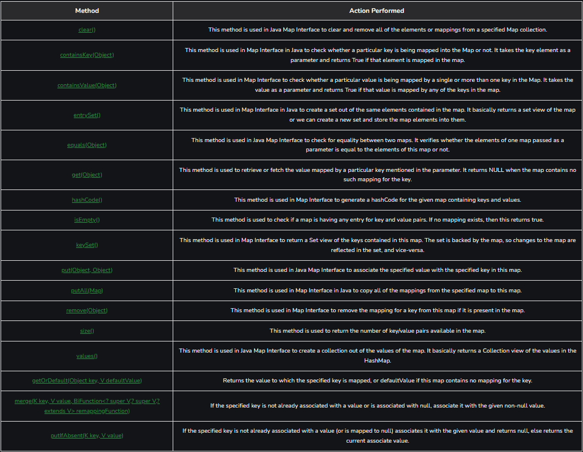

# MAPS INTERFACE

## Erstellung einer Map
Syntax: Defining Type-safe Map
````java
Map hm = new HashMap(); 
// Obj is the type of the object to be stored in Map
````

## Eigenschaften von maps
  Eine Map kann keine doppelten Schlüssel enthalten, und jedem Schlüssel kann höchstens ein Wert zugeordnet werden. Einige Implementierungen erlauben null-Schlüssel und null-Werte, wie z.B. HashMap und LinkedHashMap, während andere dies nicht tun, wie zum Beispiel TreeMap.

  Die Reihenfolge einer Map hängt von der spezifischen Implementierung ab. Zum Beispiel haben TreeMap und LinkedHashMap vorhersehbare Reihenfolgen, während HashMap dies nicht tut.

  Es gibt zwei Schnittstellen zur Implementierung von Maps in Java: Map und SortedMap, sowie drei Klassen: HashMap, TreeMap und LinkedHashMap.

# Methoden




# Beispiele

```java
// Java Program to Demonstrate 
// Working of Map interface 

// Importing required classes 
import java.util.*; 

// Main class 
class GFG { 

	// Main driver method 
	public static void main(String args[]) 
	{ 
		// Creating an empty HashMap 
		Map<String, Integer> hm 
			= new HashMap<String, Integer>(); 

		// Inserting pairs in above Map 
		// using put() method 
		hm.put("a", new Integer(100)); 
		hm.put("b", new Integer(200)); 
		hm.put("c", new Integer(300)); 
		hm.put("d", new Integer(400)); 

		// Traversing through Map using for-each loop 
		for (Map.Entry<String, Integer> me : 
			hm.entrySet()) { 

			// Printing keys 
			System.out.print(me.getKey() + ":"); 
			System.out.println(me.getValue()); 
		} 
	} 
}
```
OUTPUT =
a:100 |
b:200 |
c:300 |
d:400 |

## Hashmap
Die HashMap ist Teil von Java's Kollektionen seit Java 1.2. Sie bietet die grundlegende Implementierung des Map-Interfaces von Java. Sie speichert Daten in (Schlüssel, Wert)-Paaren. Um auf einen Wert zuzugreifen, muss man seinen Schlüssel kennen. Diese Klasse verwendet eine Technik namens Hashing. Hashing ist eine Methode, um eine große Zeichenkette in eine kleine Zeichenkette umzuwandeln, die dieselbe Zeichenkette repräsentiert. Ein kürzerer Wert erleichtert das Indexieren und beschleunigt Suchvorgänge. Schauen wir uns an, wie man ein Map-Objekt mit dieser Klasse erstellt.

```java
// Java Program to illustrate the Hashmap Class 

// Importing required classes 
import java.util.*; 

// Main class 
public class GFG { 

	// Main driver method 
	public static void main(String[] args) 
	{ 

		// Creating an empty HashMap 
		Map<String, Integer> map = new HashMap<>(); 

		// Inserting entries in the Map 
		// using put() method 
		map.put("vishal", 10); 
		map.put("sachin", 30); 
		map.put("vaibhav", 20); 

		// Iterating over Map 
		for (Map.Entry<String, Integer> e : map.entrySet()) 

			// Printing key-value pairs 
			System.out.println(e.getKey() + " "
							+ e.getValue()); 
	} 
}
```
OUTPUT=
vaibhav 20 |
vishal 10 |
sachin 30

## LinkedHashMap


`LinkedHashMap` ist ähnlich wie `HashMap`, bietet jedoch die zusätzliche Funktion, die Reihenfolge der in sie eingefügten Elemente zu erhalten. `HashMap` ermöglicht schnelle Einfügung, Suche und Löschung, behält jedoch nicht die Reihenfolge der Einfügung bei, was `LinkedHashMap` bietet. Hierbei können die Elemente in ihrer Einfügereihenfolge abgerufen werden. Schauen wir uns an, wie man ein Map-Objekt mit dieser Klasse erstellt.


```java
// Java Program to Illustrate the LinkedHashmap Class 

// Importing required classes 
import java.util.*; 

// Main class 
public class GFG { 

	// Main driver method 
	public static void main(String[] args) 
	{ 

		// Creating an empty LinkedHashMap 
		Map<String, Integer> map = new LinkedHashMap<>(); 

		// Inserting pair entries in above Map 
		// using put() method 
		map.put("vishal", 10); 
		map.put("sachin", 30); 
		map.put("vaibhav", 20); 

		// Iterating over Map 
		for (Map.Entry<String, Integer> e : map.entrySet()) 

			// Printing key-value pairs 
			System.out.println(e.getKey() + " "
							+ e.getValue()); 
	} 
}
```

OUTPUT=
vishal 10 |
sachin 30 |
vaibhav 20 |


## Treemap
`TreeMap` in Java wird verwendet, um das Map-Interface und `NavigableMap` zusammen mit der abstrakten Klasse zu implementieren. Die Map ist nach der natürlichen Reihenfolge ihrer Schlüssel sortiert oder durch einen Comparator, der zur Erstellungszeit der Map bereitgestellt wird, abhängig davon, welcher Konstruktor verwendet wird. Dies erweist sich als effiziente Methode zum Sortieren und Speichern von Schlüssel-Wert-Paaren. Die Speicherreihenfolge, die von der TreeMap beibehalten wird, muss konsistent mit `equals` sein, genauso wie bei jeder anderen sortierten Map, unabhängig von den expliziten Comparators. Schauen wir uns an, wie man ein Map-Objekt mit dieser Klasse erstellt.
```java
// Java Program to Illustrate TreeMap Class 

// Importing required classes 
import java.util.*; 

// Main class 
public class GFG { 

	// Main driver method 
	public static void main(String[] args) 
	{ 

		// Creating an empty TreeMap 
		Map<String, Integer> map = new TreeMap<>(); 

		// Inserting custom elements in the Map 
		// using put() method 
		map.put("vishal", 10); 
		map.put("sachin", 30); 
		map.put("vaibhav", 20); 

		// Iterating over Map using for each loop 
		for (Map.Entry<String, Integer> e : map.entrySet()) 

			// Printing key-value pairs 
			System.out.println(e.getKey() + " "
							+ e.getValue()); 
	} 
}
```

OUTPUT=
sachin 30 |
vaibhav 20 |
vishal 10 |

# Operationen

## Einfügen von Werten
Um ein Element zur Map hinzuzufügen, können wir die Methode `put()` verwenden. Allerdings wird die Einfügereihenfolge im HashMap nicht beibehalten. Intern wird für jedes Element ein separater Hash generiert, und die Elemente werden basierend auf diesem Hash indexiert, um es effizienter zu gestalten.

## Ändern von Werten
Nachdem die Elemente hinzugefügt wurden, können wir, wenn wir ein Element ändern möchten, dies erneut durch Hinzufügen des Elements mit der Methode `put()` tun. Da die Elemente in der Map anhand der Schlüssel indiziert sind, kann der Wert des Schlüssels einfach geändert werden, indem der aktualisierte Wert für den gewünschten Schlüssel eingefügt wird.

## Werte entfernen
Um ein Element aus der Map zu entfernen, können wir die Methode `remove()` verwenden. Diese Methode nimmt den Schlüsselwert entgegen und entfernt die Zuordnung für einen Schlüssel aus dieser Map, wenn er in der Map vorhanden ist.

## Iterieren
Es gibt mehrere Möglichkeiten, durch die Map zu iterieren. Der bekannteste Weg ist die Verwendung einer for-each-Schleife und das Abrufen der Schlüssel. Der Wert des Schlüssels wird durch die Verwendung der Methode `getValue()` gefunden.

## Anzahl des selben Werts auszählen 
In diesem Code verwenden wir `putIfAbsent()` zusammen mit `Collections.frequency()`, um das genaue Auftreten von Zahlen zu zählen. In vielen Programmen müssen Sie das Auftreten einer bestimmten Zahl oder eines Buchstabens zählen. Sie verwenden den folgenden Ansatz, um solche Probleme zu lösen.